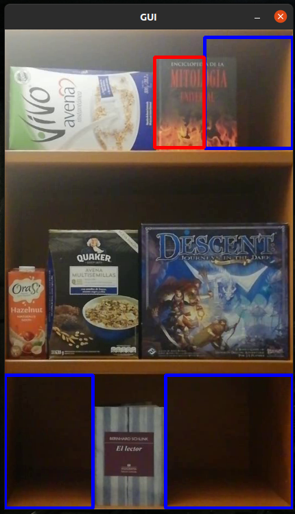

# STOCKY - PROYECTO ELO328, Grupo 4, 2020 S2
## Participantes
En esta tarea participaron:
- Luciano Flores
- Martín Miranda
- Tomás Muñoz 
- Francisco Romero
                            
## Descripcion

En este proyecto estamos desarrollando una herramienta para supermercados o establecimientos similares para que puedan *trackear* el *stock* o falta del mismo, entregando alertas a los reponedores cuando falte un producto en un pasillo o bien cuando haya alguno fuera de lugar.

## Antes de usar...

1) Se necesita OpenCV con las libreríade colaboradores (NON FREE):

 La base de los pasos a continuación se encuentran en https://linuxize.com/post/how-to-install-opencv-on-ubuntu-20-04/, pero están ligeramente editados en la parte del build.

- Pasos previos
```
sudo apt-get install build-essential
```

```
sudo apt-get install cmake git libgtk2.0-dev pkg-config libavcodec-dev libavformat-dev libswscale-dev
```

```
sudo apt-get install python-dev python-numpy libtbb2 libtbb-dev libjpeg-dev libpng-dev libtiff-dev libjasper-dev libdc1394-22-dev
```

- Clonar OpenCV y OpenCV de contribuidores desde repositorios:
```
mkdir ~/opencv_build && cd ~/opencv_build
```
```
git clone https://github.com/opencv/opencv.git
```
```
git clone https://github.com/opencv/opencv_contrib.git
```
- Crear directorio build y navegar hacia él
```
git clone https://github.com/opencv/opencv_contrib.git
```

- Construir (build) OpenCV con como **mínimo** las siguientes flags.

```
cmake -D CMAKE_BUILD_TYPE=RELEASE \
    -D CMAKE_INSTALL_PREFIX=/usr/local \
    -D INSTALL_C_EXAMPLES=ON \
    -D INSTALL_PYTHON_EXAMPLES=ON \
    -D OPENCV_GENERATE_PKGCONFIG=ON \
    -D OPENCV_EXTRA_MODULES_PATH=~/opencv_build/opencv_contrib/modules \
    -D BUILD_EXAMPLES=ON \
    -D OPENCV_EXTRA_MODULES_PATH=~/opencv_build/opencv_contrib/modules \
    -D OPENCV_ENABLE_NONFREE=ON  ..
```

- Compilar

```
make -j8
```
- Instalar OpenCV
```
sudo make install
```
- Si es que se instaló correctamente al correr...
```
pkg-config --modversion opencv4
```
- ... debería tenerse como resultado algo como lo siguiente:
```
Output
4.5.3
```

## Para compilar

Parado en la raiz del proyecto...

- Sin debug:
```
cmake -D WITH_CUDA=OFF -S . -B build && cmake --build build
```
- Con debug: (Solo recomendable si se quisiera editar el código)
```
cmake -D WITH_CUDA=OFF -DCMAKE_BUILD_TYPE=Debug -S . -B build && cmake --build build
```

## Consideraciones previas

Se necesitan 2 archivos para correr el programa:

- Revisar que en la carpeta samples se encuentre video6.mp4
- Revisar que en la carpeta app/data se encuentre data3.json

## Para correr

Parado en la carpeta raíz del proyecto ejecutar:

```
./build/app/STOCKY
```

También se podrían agregar las rutas al video y json aunque están por defecto:

```
./build/app/STOCKY samples/videos/video6.mp4 app/data/data3.json
```

O bien para obtener intrucciones:
```
./build/app/STOCKY -help
```

## Funcionamiento actual

