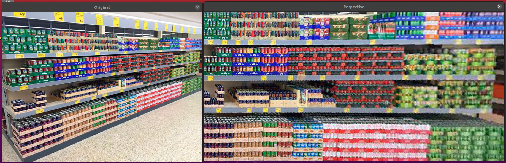
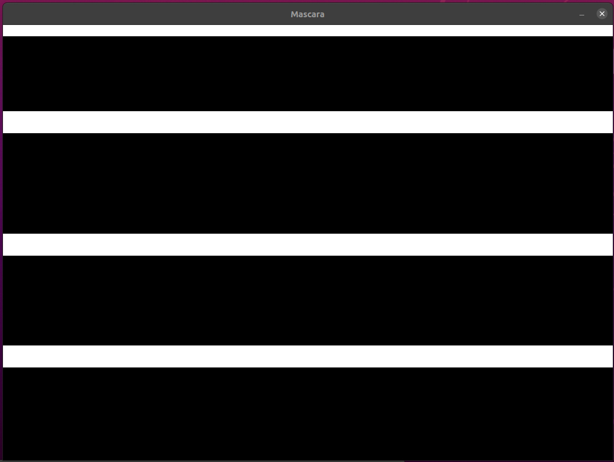
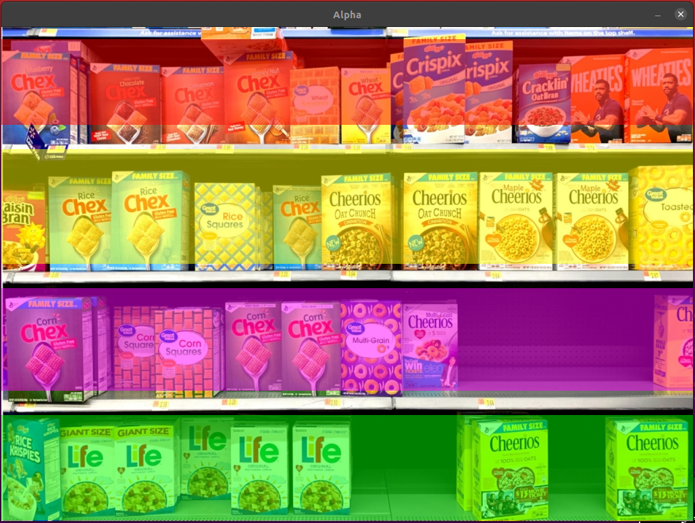
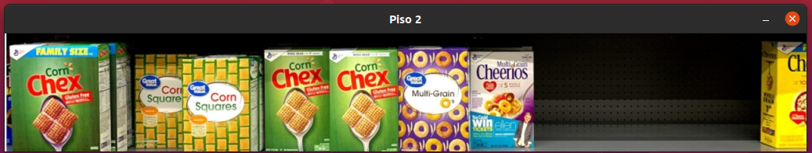
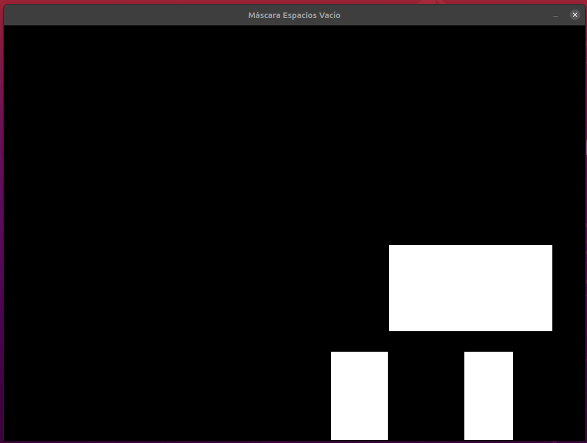
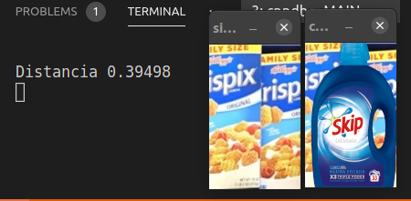

# STOCKY - PROYECTO ELO328, Grupo 4, 2020 S2
## Participantes
En esta tarea participaron: Luciano Flores
                            Martín Miranda
                            Tomás Muñoz
                            Francisco Romero
                            
## Descripcion

En este proyecto estamos desarrollando una herramienta para supermercados o establecimientos similares para que puedan *trackear* el *stock* o falta del mismo, entregando alertas a los reponedores cuando falte un producto en un pasillo o bien cuando haya alguno fuera de lugar.

## Ejemplos de Funcionamiento actual

### Cambio de Perspectiva de imagen original

### Separación de Repisas en pisos

### Espacios Vacíos en Repisa

### Pruebas para identificar cambios de productos 

Esto más tarde servirá para detecatar un producto fuera de lugar si se agrega un historial

